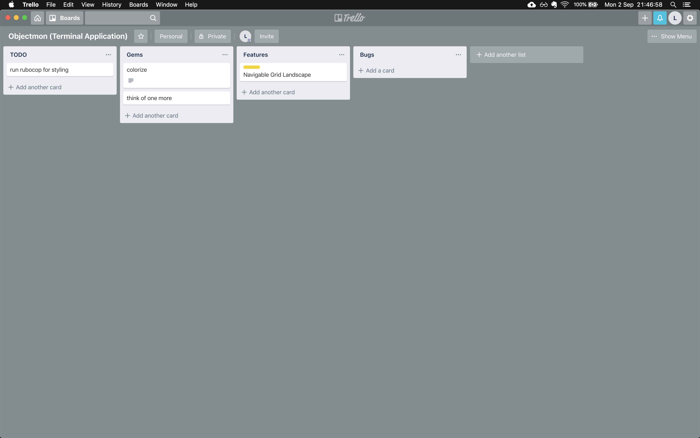

# objectmon-terminal-application
A very, very basic Pokemon style game running as a text/ascii based terminal application.

## Gameplay instructions

### The Map

* ascii art icons on the map represent terrain type
  - grass terrain represented by "
  - mountain terrain represented by ^
  - volcano terrain represented by /\~

### Trello Board
https://trello.com/b/nwIEDiKE


<some markdown examples>

#### markdown examples IGNORE AND REMOVE WHEN DONE

1. an ordered
2. list
3. instead of bullets

````ruby
# code blocks can be made with backticks, can supply a language for extra formatting
x = 1
y = "example"
````

[link example](www.google.com)

